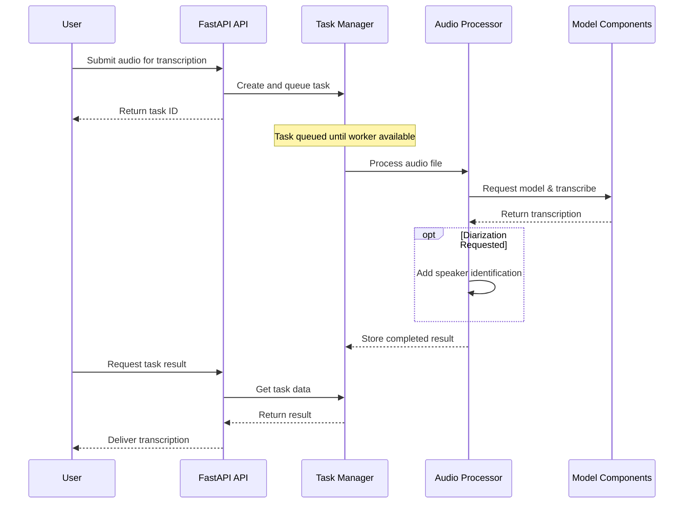
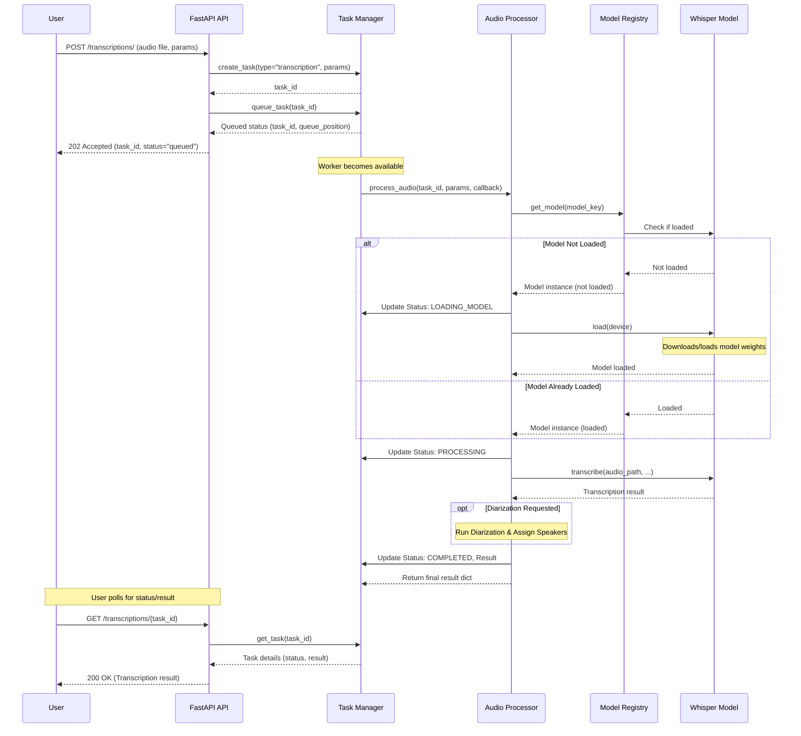

# 🏗️ Application Architecture

This document outlines the architecture and workflow of the Whisper Transcription API.

## 📋 Table of Contents
- [Project Structure](#-project-structure)
- [Core Workflow](#-core-workflow-transcription-task)
- [Key Components](#-key-components)
- [Adding a New Transcription Model](#-adding-a-new-transcription-model)

## 📂 Project Structure

The project follows a standard structure for FastAPI applications:

```
app/
├── api/                      # API layer (FastAPI routers and request handling)
│   ├── router_registry.py    # Router definitions
│   └── routes/               # Route handlers (health, system, transcription, diarization)
├── models/                   # Model definitions (e.g., Whisper model wrapper)
│   └── whisper_model.py      # Whisper model implementation using Transformers
├── services/                 # Core business logic and services
│   ├── diarization.py        # Speaker diarization service (using pyannote)
│   ├── model_registry.py     # Manages loading/unloading of transcription models
│   ├── processor.py          # Orchestrates the audio processing pipeline
│   ├── task_manager.py       # Handles asynchronous task queuing and execution
│   └── transcriber.py        # Helper for transcription
├── config.py                 # Application configuration (settings from .env)
├── exceptions.py             # Custom exception classes
└── main.py                   # FastAPI application entry point
```

## 🌊 Core Workflow (Transcription Task)

### High-Level Overview

The following diagram shows the simplified flow of a transcription request through the system:



<details>
<summary><b>Click to view detailed workflow diagram</b></summary>


</details>

### Workflow Explained:

1. **Request Handling**:
   - User sends a POST request with audio file and parameters
   - API validates the request and creates a task
   - User receives a task ID immediately

2. **Task Processing**:
   - Task enters queue and waits for an available worker
   - When processing begins, system checks if the requested model is loaded
   - If needed, model is loaded from Hugging Face
   - Audio is transcribed using the Whisper model

3. **Optional Diarization**:
   - If requested, speaker recognition is performed
   - Speakers are assigned to transcription segments

4. **Result Retrieval**:
   - User polls for task status using the task ID
   - Once completed, transcription results are returned

5. **Cleanup**:
   - Files are automatically deleted based on configuration

## 🔑 Key Components

* **FastAPI (`app/main.py`, `app/api/`)**: 
  Handles HTTP requests, routing, validation, and responses

* **TaskManager (`app/services/task_manager.py`)**: 
  Manages asynchronous tasks - queuing, execution, status tracking, and cleanup

* **Audio Processor (`app/services/processor.py`)**: 
  Orchestrates audio processing steps - model acquisition, transcription, diarization

* **ModelRegistry (`app/services/model_registry.py`)**: 
  Handles model instances, loading/unloading, and resource management

* **WhisperModel (`app/models/whisper_model.py`)**: 
  Wraps the Hugging Face implementation of Whisper

* **DiarizationService (`app/services/diarization.py`)**: 
  Handles speaker diarization using pyannote.audio

* **Configuration (`app/config.py`)**: 
  Loads settings from environment variables using pydantic-settings

## ✨ Adding a New Transcription Model

To add support for a new transcription model:

1. **Implement Model Wrapper**:
   - Create a new class in `app/models/` inheriting from `TranscriptionModel`
   - Implement required methods:
     ```python
     @ModelRegistry.register
     class MyNewModel(TranscriptionModel):
         def __init__(self, model_size: str, ...):
             super().__init__(...)
             
         def load(self, device: Optional[str] = None):
             # Logic to load model weights
             self._loaded = True
             
         def unload(self):
             # Release resources
             self._loaded = False
             
         def is_loaded(self) -> bool:
             return self._loaded
             
         def transcribe(self, audio_path: str, ...) -> Dict[str, Any]:
             # Perform transcription
             return {"text": "...", "segments": [...]}
     ```

2. **Update Configuration**:
   ```python
   # In app/config.py
   WHISPER_MODEL_MAPPING = {
       # ... existing models ...
       "my-custom-model": "huggingface/path-to-your-model",
   }
   ```

3. **Update Documentation**:
   - Add your new model to the README.md

4. **Restart API**:
   - The application needs to restart to register the new model
