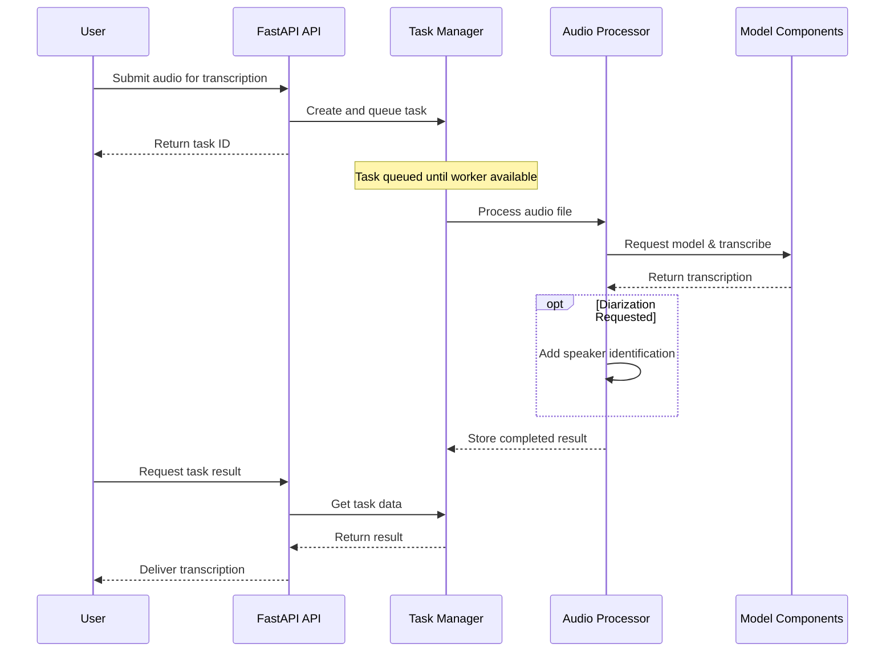
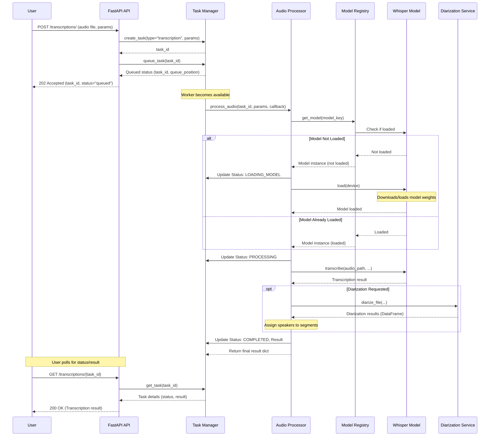

# 🏗️ Application Architecture

This document outlines the architecture and workflow of the Whisper Transcription API.

## 📋 Table of Contents
- [Project Structure](#-project-structure)
- [Core Workflow](#-core-workflow-transcription-task)
- [Key Components](#-key-components)
- [API Endpoints](#-api-endpoints)
- [Adding a New Transcription Model](#-adding-a-new-transcription-model)

## 📂 Project Structure

The project follows a standard structure for FastAPI applications:

```
app/
├── api/                      # API layer (FastAPI routers and request handling)
│   ├── router_registry.py    # Router definitions
│   └── routes/               # Route handlers (health, system, transcription, diarization)
├── models/                   # Model definitions (e.g., Whisper model wrapper)
│   └── whisper_model.py      # Whisper model implementation using Transformers
├── services/                 # Core business logic and services
│   ├── diarization.py        # Speaker diarization service (using pyannote)
│   ├── model_registry.py     # Manages loading/unloading of transcription models
│   ├── processor.py          # Orchestrates the audio processing pipeline
│   └── task_manager.py       # Handles asynchronous task queuing and execution
├── cli.py                    # Command-line interface script
├── config.py                 # Application configuration (settings from .env)
├── exceptions.py             # Custom exception classes
├── logging_config.py         # Logging setup
└── main.py                   # FastAPI application entry point
```

## 🌊 Core Workflow (Transcription Task)

### High-Level Overview

The following diagram shows the simplified flow of a transcription request through the system:



<details>
<summary><b>Click to view detailed workflow diagram</b></summary>


</details>

### Workflow Explained:

1. **Request Handling**:
   - User sends a POST request with audio file and parameters
   - API validates the request and creates a task
   - User receives a task ID immediately

2. **Task Processing**:
   - Task enters queue and waits for an available worker
   - When processing begins, system checks if the requested model is loaded
   - If needed, model is loaded from Hugging Face
   - Audio is transcribed using the Whisper model

3. **Optional Diarization**:
   - If requested, the `DiarizationService` is called to perform speaker recognition.
   - The `Processor` then assigns the identified speakers to the transcription segments.

4. **Result Retrieval**:
   - User polls for task status using the task ID
   - Once completed, transcription results are returned

5. **Cleanup**:
   - Files are automatically deleted based on configuration

## 🔑 Key Components

* **FastAPI (`app/main.py`, `app/api/`)**: 
  Handles HTTP requests, routing, validation, and responses

* **TaskManager (`app/services/task_manager.py`)**: 
  Manages asynchronous tasks - queuing, execution, status tracking, and cleanup

* **Audio Processor (`app/services/processor.py`)**: 
  Orchestrates audio processing steps - model acquisition, transcription, diarization

* **ModelRegistry (`app/services/model_registry.py`)**: 
  Handles model instances, loading/unloading, and resource management

* **WhisperModel (`app/models/whisper_model.py`)**: 
  Wraps the Hugging Face implementation of Whisper

* **DiarizationService (`app/services/diarization.py`)**:
  Handles speaker diarization using `pyannote.audio` (if dependencies are installed).

* **Configuration (`app/config.py`)**: 
  Loads settings from environment variables using pydantic-settings

## 📊 API Endpoints

Access interactive documentation at `/docs`

### Health Checks

| Method | Endpoint | Description |
|--------|----------|-------------|
| `GET` | `/health/` | API Health Check |

### System & Monitoring

| Method | Endpoint | Description |
|--------|----------|-------------|
| `GET` | `/system/status` | Get Overall System Status |
| `GET` | `/system/gpu` | Get Detailed GPU Status |
| `GET` | `/system/models` | List Available Models |
| `POST` | `/system/models/{model_name}/load` | Load a Model |
| `POST` | `/system/models/{model_name}/unload` | Unload a Model |
| `GET` | `/system/queue` | Get Task Queue Status |

### Transcription

| Method | Endpoint | Description |
|--------|----------|-------------|
| `POST` | `/transcriptions/` | Submit Transcription Job |
| `GET` | `/transcriptions/{task_id}/status` | Get Transcription Job Status |
| `GET` | `/transcriptions/{task_id}` | Get Transcription Job Result |
| `DELETE` | `/transcriptions/{task_id}` | Delete Transcription Job |

### Diarization

| Method | Endpoint | Description |
|--------|----------|-------------|
| `POST` | `/diarize/` | Submit Diarization Only Job |
| `GET` | `/diarize/{task_id}/status` | Get Diarization Task Status |
| `GET` | `/diarize/{task_id}` | Get Diarization Task Result |
| `DELETE` | `/diarize/{task_id}` | Delete Diarization Task |

## ✨ Adding a New Transcription Model

To add support for a new transcription model:

1. **Implement Model Wrapper**:
   - Create a new Python file in `app/models/` (e.g., `my_new_model.py`).
   - Define a class inheriting from `app.services.model_registry.TranscriptionModel`.
   - Implement the required methods: `load`, `unload`, `is_loaded`, and `transcribe`.
   - **Crucially**, decorate the class with `@ModelRegistry.register` and ensure the class has a unique `name` attribute (e.g., `name = "my-new-model"`).
     ```python
     # In app/models/my_new_model.py
     from app.services.model_registry import TranscriptionModel, ModelRegistry

     @ModelRegistry.register
     class MyNewModel(TranscriptionModel):
         name = "my-new-model" # Unique name for registration

         def __init__(self, ...): # Add necessary init args
             super().__init__(...)
             self._loaded = False
             # ... other initialization ...
             
         def load(self, device: Optional[str] = None):
             # Logic to load model weights
             # ...
             self._loaded = True
             
         def unload(self):
             # Release resources
             # ...
             self._loaded = False
             
         def is_loaded(self) -> bool:
             return self._loaded
             
         def transcribe(self, audio_path: str, **kwargs) -> Dict[str, Any]:
             # Perform transcription using your model
             # ...
             return {"text": "...", "segments": [...]}
     ```

2. **Ensure Discovery**:
   - The `ModelRegistry` automatically discovers models in the `app.models` package when the application starts (specifically, when `ModelRegistry.available_models()` or `get_model()` is first called). Ensure your new file is imported correctly (e.g., via `app/models/__init__.py` if needed, though the decorator often handles this).

3. **Update Documentation**:
   - Add your new model key (e.g., `"my-new-model"`) to the relevant sections of the README.md.

4. **Restart API**:
   - The application needs to restart to pick up the new Python file and register the model class during discovery.
